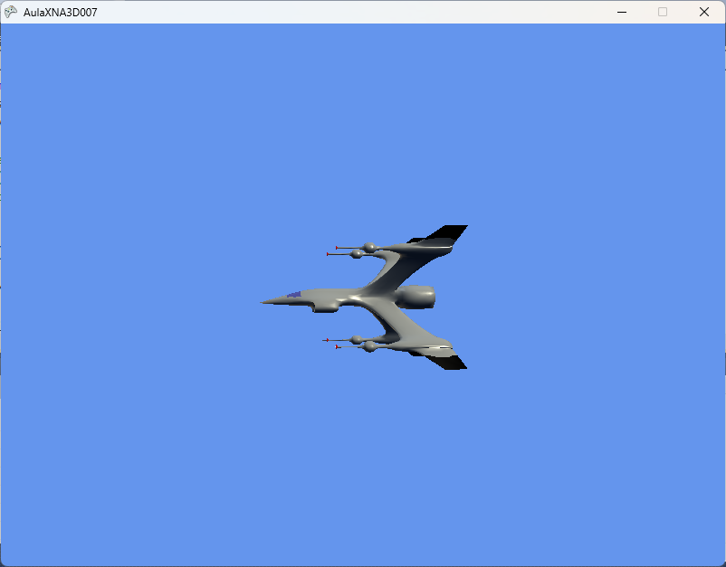

# XNA_007_MODELO3D

Este repositório contém o projeto didático **AulaXNA3D007**, o sétimo passo no estudo de Computação Gráfica 3D utilizando a linguagem **C#** e o framework **Microsoft XNA Game Studio 4.0**.

O objetivo deste projeto é ensinar o conceito de **Carregamento e Renderização de Modelos 3D** (`Model`, `ModelMesh` e `ModelBone`), demonstrando a importação do modelo clássico da nave espacial (`spaceship.x`) através do Content Pipeline do XNA, a hierarquia de transformações de ossos com `CopyAbsoluteBoneTransformsTo`, iluminação padrão com `BasicEffect.EnableDefaultLighting()` e manipulação da matriz de mundo via rotação contínua no eixo Y.

---

## 📸 Resultado Esperado



*Nota: A imagem acima representa o modelo 3D da nave espacial iluminado e renderizado com rotação contínua no espaço tridimensional.*

---

## 🛠️ Como o Projeto Funciona

O projeto demonstra como carregar malhas tridimensionais complexas a partir de arquivos externos e desenhá-las na GPU utilizando as classes de alto nível do XNA:

### 1. A Entidade da Nave: [`_Spaceship.cs`](AulaXNA3D007/AulaXNA3D007/_Spaceship.cs)
Esta classe encapsula todo o ciclo de vida do modelo 3D da nave espacial:

* **Carregamento via Content Pipeline**:
  O modelo em formato DirectX (`spaceship.x`) é compilado para o formato binário do XNA (`.xnb`) e carregado em tempo de execução:
  ```csharp
  this.model = this.game.Content.Load<Model>(@"Models\spaceship");
  ```
* **Hierarquia de Ossos (`ModelBone`)**:
  Para garantir que malhas com múltiplos componentes ou hierarquias complexas (pai $\rightarrow$ filho) sejam posicionadas corretamente no espaço do objeto, as transformações absolutas dos ossos são extraídas:
  ```csharp
  this.modelTransforms = new Matrix[this.model.Bones.Count];
  this.model.CopyAbsoluteBoneTransformsTo(modelTransforms);
  ```
* **Iluminação e Desenho (`Draw`)**:
  No método `Draw()`, o código itera sobre todas as malhas (`ModelMesh`) e seus respectivos efeitos embutidos (`BasicEffect`), aplicando a iluminação padrão e compondo a matriz de mundo final:
  ```csharp
  foreach (ModelMesh mesh in this.model.Meshes)
  {
      foreach (BasicEffect effect in mesh.Effects)
      {
          effect.EnableDefaultLighting();
          effect.World = modelTransforms[mesh.ParentBone.Index] * this.world;
          effect.View = camera.GetView();
          effect.Projection = camera.GetProjection();
      }
      mesh.Draw();
  }
  ```
* **Composição da Matriz de Mundo**:
  A matriz `world` é construída aplicando a ordem canônica de transformações lineares: **Escala $\rightarrow$ Rotação (X, Y, Z) $\rightarrow$ Translação**:
  ```csharp
  this.world = Matrix.Identity;
  this.world *= Matrix.CreateScale(this.scale);
  this.world *= Matrix.CreateRotationX(MathHelper.ToRadians(this.rotation.X));
  this.world *= Matrix.CreateRotationY(MathHelper.ToRadians(this.rotation.Y));
  this.world *= Matrix.CreateRotationZ(MathHelper.ToRadians(this.rotation.Z));
  this.world *= Matrix.CreateTranslation(this.position);
  ```
* **Atualização Temporal (`Update`)**:
  A rotação no eixo Y é incrementada a cada quadro com base no tempo decorrido em segundos (`TotalSeconds`), garantindo rotação suave e independente da taxa de quadros por segundo (FPS).

### 2. A Classe Principal: [`Game1.cs`](AulaXNA3D007/AulaXNA3D007/Game1.cs)
* Inicializa o dispositivo gráfico em resolução $800 \times 600$.
* Cria a instância da tela Singleton (`_Screen`), da câmera (`_Camera`) e da nave (`_Spaceship`).
* No loop `Draw`, limpa o buffer de cor com `Color.CornflowerBlue` e renderiza a nave passando a câmera como parâmetro.

### 3. A Câmera Estática: [`_Camera.cs`](AulaXNA3D007/AulaXNA3D007/_Camera.cs)
* Posicionada em `(0, 0, 7)` olhando diretamente para a origem `(0, 0, 0)`.
* Projeção em perspectiva com campo de visão (FOV) de 45° ($\pi / 4$), plano próximo em $0.001$ e plano distante em $1000$.

---

## 💻 Requisitos do Sistema

* **Sistema Operacional**: Windows 7, 8, 10 ou 11 (com runtimes do XNA e DirectX 9 instalados).
* **IDE**: Microsoft Visual Studio 2010.
* **Framework**: Microsoft XNA Game Studio 4.0.
* **Dependência**: .NET Framework 4.0 Client Profile.

---

## 🚀 Como Executar

1. Clone este repositório:
   ```bash
   git clone https://github.com/FCA-GAMEDEV/XNA_007_MODELO3D.git
   ```
2. Abra o arquivo `AulaXNA3D007.sln` utilizando o Visual Studio 2010.
3. Pressione `F5` para compilar e rodar.
